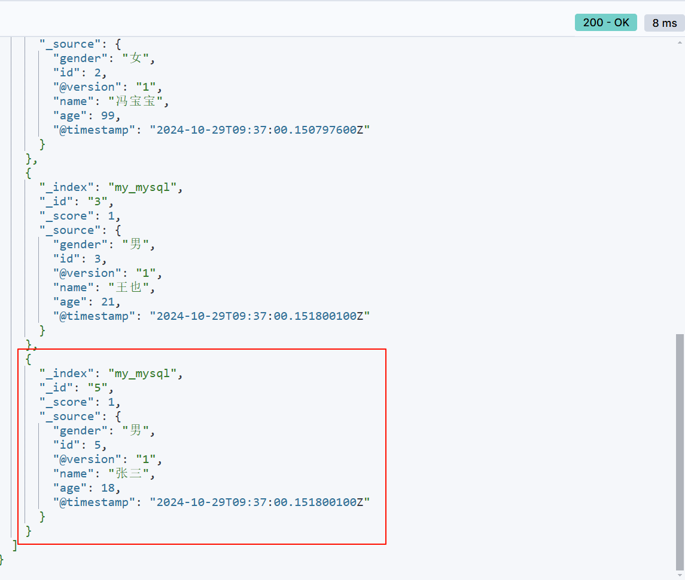

# 实验四 Logstash操作

**学院：省级示范性软件学院**

**课程：高级数据库技术与应用**

**题目：**《实验四 Logstash操作》

**姓名：**邹子昂

**学号：**2100240124

**班级：**软工2202

**日期：**2024-10-29

**实验环境：** Kibana8.12.2 & Elasticsearch8.12.2

## 一、实验目的

- 掌握Logstash数据处理流程
- 掌握Elasticsearch的聚合分析功能

## 二、实验内容

### 1.1. tomcat日志处理

#### 1. 将tomcat的logs中的localhost_access_log访问日志导入到本地的elasticsearch中

```json
@timestamp:
类型: date
描述: 记录日志事件的时间戳，用于时间序列分析和按时间过滤查询。

@version:
类型: text
描述: 日志的版本信息，用于区分不同版本的日志格式。包含 keyword 字段以支持精确匹配。

event.original:
类型: text
描述: 原始日志事件的内容。包含 keyword 字段用于精确搜索。

host.name:
类型: text
描述: 生成日志的主机名。包含 keyword 字段用于主机名的精确过滤和搜索。

http.request.method:
类型: text
描述: HTTP 请求方法（如 GET, POST），用于分析不同请求类型。包含 keyword 字段用于精确匹配。

http.response.body.bytes:
类型: long
描述: HTTP 响应体的字节数，表示服务器返回的内容大小。用于分析数据传输量。

http.response.status_code:
类型: long
描述: HTTP 响应状态码，用于分析请求成功 (200)，失败 (404)，或其他状态。

http.version:
类型: text
描述: HTTP 协议的版本信息。包含 keyword 字段用于精确匹配。

log.file.path:
类型: text
描述: 日志文件的完整路径，记录日志来源。包含 keyword 字段用于精确匹配和过滤。

message:
类型: text
描述: 日志的主要消息部分，存储每条日志的内容。包含 keyword 字段用于精确搜索。

source.address:
类型: text
描述: 日志来源的地址，通常是 IP 地址或 URL。包含 keyword 字段用于精确匹配。

timestamp:
类型: text
描述: 记录日志的时间戳字段，但与 @timestamp 不同，可能是原始日志中的时间表示。包含 keyword 字段。

url.original:
类型: text
描述: 请求的原始 URL，用于分析用户访问的页面。包含 keyword 字段用于精确匹配。
```

#### 2. 数据导入到一个名为tomcat_logs的索引

在``config``中创建``logstash_tomcat.conf``

```shell
input {
  file {
    path => "D:/professional_course_files/business_course/advanced_database/homework/demo4/tomcat_logs/localhost_access_log.2024-10-21.txt"
    start_position => "beginning"   # 从文件的开头开始读取
    sincedb_path => "NUL"           # 用于避免Logstash记住文件读取的进度，确保每次运行Logstash时都会从头读取文件
  }
}

filter {
  # 解析Tomcat日志中的常见Apache日志格式
  grok {
    match => { "message" => "%{COMMONAPACHELOG}" }
  }

  # 解析日期格式
  date {
    match => [ "timestamp" , "dd/MMM/yyyy:HH:mm:ss Z" ]
    target => "@timestamp"
  }
}

output {
  elasticsearch {
    hosts => ["http://localhost:9200"]
    index => "tomcat_logs"
  }
  stdout { codec => rubydebug }
}
```

在控制台输入命令：

```bash
bin\logstash -f config\logstash_tomcat.conf
```

#### 3. 在elasticsearch中做5个日志相关的分析

##### 1) 统计不同的HTTP状态码

```json
POST /tomcat_logs/_search
{
  "size": 0,
  "aggs": {
    "status_HTTP": {
      "terms": {
        "field": "http.response.status_code"
      }
    }
  }
}
```


##### 2) 按时间查看请求

```json
POST /tomcat_logs/_search
{
  "size": 0,
  "aggs": {
    "status_time": {
      "date_histogram": {
        "field": "@timestamp",
        "fixed_interval": "1h"
      }
    }
  }
}
```


##### 3) 统计不同的请求方法

```json
POST /tomcat_logs/_search
{
  "size": 0,
  "aggs": {
    "stauts_method": {
      "terms": {
        "field": "http.request.method.keyword"
      }
    }
  }
}
```


##### 4) 按URL统计访问量

```json
POST /tomcat_logs/_search
{
  "size": 0,
  "aggs": {
    "status_URL": {
      "terms": {
        "field": "url.original.keyword"
      }
    }
  }
}
```


##### 5) 按客户端IP统计请求数

```json
POST /tomcat_logs/_search
{
  "size": 0,
  "aggs": {
    "client_ip": {
      "terms": {
        "field": "source.address.keyword"
      }
    }
  }
}
```


### 1.2. 数据转换和传输

#### 1. 将本地的mysql数据库中的一张表导入到本地的elasticsearch中。

在``config``中创建``mysql_to_es.conf``

```shell
input {
  jdbc {
    jdbc_connection_string => "jdbc:mysql://localhost:3306/jdbc_demo"
    jdbc_user => "root"
    jdbc_password => "123456"
    jdbc_driver_library => "D:/professional_course_files/business_course/advanced_database/logstash-8.12.2/logstash-core/lib/jars/mysql-connector-j-9.1.0.jar"
    jdbc_driver_class => "com.mysql.cj.jdbc.Driver"
    schedule => "* * * * *"  # 每分钟检查一次数据库更新
    statement => "select * from student"
  }
}

filter {
}

output {
  elasticsearch {
    hosts => ["http://localhost:9200"]
    index => "my_mysql"
    document_id => "%{id}"
  }
  stdout { codec => json_lines }
}

```

在控制台输入命令：

```bash
bin\logstash -f config\mysql_to_es.conf
```

#### 2. 数据库表更新后，数据能够自动同步到elasticsearch中。

修改前：


修改后（新增``'5', '张三', 18, '男``'）：



## 三、问题及解决办法

1. 创建``logstash_tomcat.conf``后，导入文件路径时需使用正斜杠/来衔接，不能使用反斜杠或双反斜杠，否则会出现识别不了路径的问题，正确路径为``D:/professional_course_files/business_course/advanced_database/homework/demo4/tomcat_logs/localhost_access_log.2024-10-21.txt``