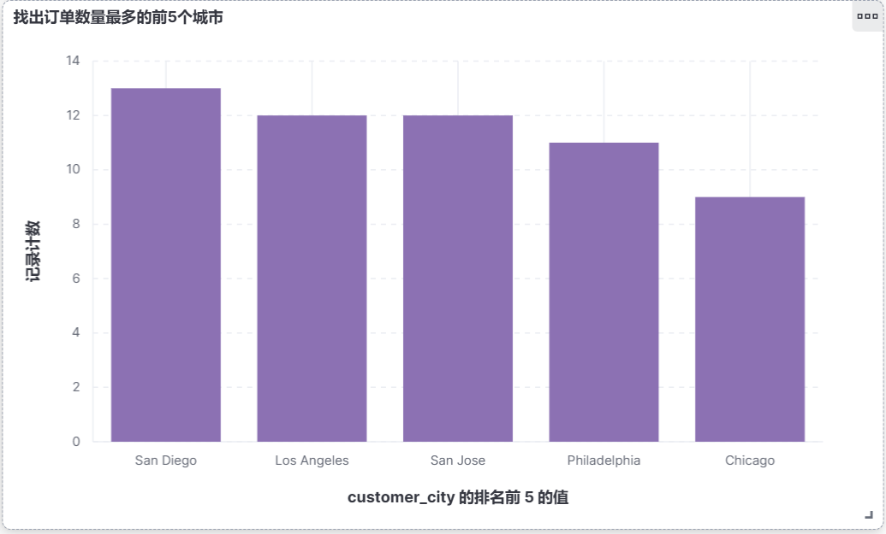

# 实验五 Kibana 操作

**学院：省级示范性软件学院**

**课程：高级数据库技术与应用**

**题目：**《实验五 Kibana 操作》

**姓名：**邹子昂

**学号：**2100240124

**班级：**软工2202

**日期：**2024-11-6

**实验环境：** Kibana8.12.2 & Elasticsearch8.12.2

## 一、实验目的

- 掌握Logstash数据处理流程
- 掌握Elasticsearch的聚合分析功能

## 二、实验内容

### 1. 使用Kibana完成《实验三 聚合操作》的10道题

##### 1. 统计每个产品类别的总销售额。

```json
POST /ecommerce/_search
{
  "size": 0, 
  "aggs": {
    "sales_by_category": {
      "terms": {
        "field": "product_category", 
        "size": 10
      },
      "aggs": {
        "total_sales": {
          "sum": {
            "field": "total_amount"
          }
        }
      }
    }
  }
}
```


##### 2. 计算每个城市的平均订单金额。

```json
POST /ecommerce/_search
{
  "size": 0,
  "aggs": {
    "avg_order_by_city": {
      "terms": {
        "field": "customer_city",
        "size": 20
      },
      "aggs": {
        "average_order_amount": {
          "avg": {
            "field": "total_amount"
          }
        }
      }
    }
  }
}
```


##### 3. 找出销量最高的前5个产品。

```json
POST /ecommerce/_search
{
  "size": 0,
  "aggs": {
    "rank_production": {
      "terms": {
        "field": "product_name",
        "size": 5,
        "order": {
          "sum_production": "desc"
        }
      },
      "aggs": {
        "sum_production": {
          "sum": {
            "field": "quantity"
          }
        }
      }
    }
  }
}
```


##### 4. 计算男性和女性客户的平均年龄。

```json
POST /ecommerce/_search
{
  "size": 0,
  "aggs": {
    "avg_gender": {
      "terms": {
        "field": "customer_gender",
        "size": 2
      },
      "aggs": {
        "avg_age": {
          "avg": {
            "field": "customer_age"
          }
        }
      }
    }
  }
}
```


##### 5. 统计每种支付方式的使用次数和总金额。

```json
POST /ecommerce/_search
{
  "size": 0,
  "aggs": {
    "status_pay": {
      "terms": {
        "field": "payment_method",
        "size": 10
      },
      "aggs": {
        "count_pay": {
          "value_count": {
            "field": "payment_method"
          }
        },
        "sum_amount": {
          "sum": {
            "field": "total_amount"
          }
        }
      }
    }
  }
}
```


##### 6. 计算每月的总销售额。

```json
POST /ecommerce/_search
{
  "size": 0,
  "aggs": {
    "status_sale": {
      "date_histogram": {
        "field": "order_date",
        "calendar_interval": "month"
      },
      "aggs": {
        "sum_amount": {
          "sum": {
            "field": "total_amount"
          }
        }
      }
    }
  }
}
```


##### 7. 找出平均订单金额最高的前3个客户。

```json
POST /ecommerce/_search
{
  "size": 0,
  "aggs": {
    "rank3_customer": {
      "terms": {
        "field": "customer_id",
        "size": 3,
        "order": {
          "avg_amount": "desc"
        }
      },
      "aggs": {
        "avg_amount": {
          "avg": {
            "field": "total_amount"
          }
        }
      }
    }
  }
}
```


##### 8. 计算每个年龄段（18-30，31-50，51+）的客户数量。

```json
POST /ecommerce/_search
{
  "size": 0,
  "aggs": {
    "range_age": {
      "range": {
        "field": "customer_age",
        "ranges": [
          {"from": 18, "to": 30},
          {"from": 31, "to": 50},
          {"from": 51}
        ]
      }
    }
  }
}
```


##### 9. 计算每个产品类别的平均单价。

```json
POST /ecommerce/_search
{
  "size": 0,
  "aggs": {
    "status_price": {
      "terms": {
        "field": "product_category"
      },
      "aggs": {
        "avg_price": {
          "avg": {
            "field": "price"
          }
        }
      }
    }
  }
}
```


##### 10. 找出订单数量最多的前5个城市。

```json
POST /ecommerce/_search
{
  "size": 0,
  "aggs": {
    "status_country": {
      "terms": {
        "field": "customer_city",
        "size": 5,
        "order": {
          "count_city": "desc"
        }
      },
      "aggs": {
        "count_city": {
          "value_count": {
            "field": "order_id"
          }
        }
      }
    }
  }
}
```


### 2. 将做好的10个可视化放到1个或2个仪表盘中




### 3. 仪表盘中增加一些控件，文字描述，筛选等

如上

## 三、问题及解决办法

暂时无
